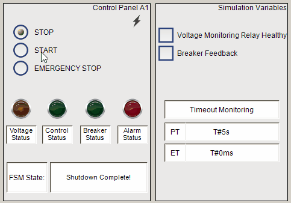
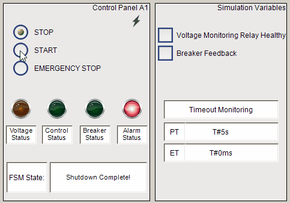

# 🟢 Control Panel Start-Up/Shutdown Sequencer

This TwinCAT 3 PLC project simulates the **start-up and shutdown sequence of an industrial control panel**, using a finite state machine (FSM) to manage each step safely and reliably.

It demonstrates electrical control principles such as interlocking, safety logic, simulated voltage detection, and orderly power sequencing—common in MCCs, switchgear, and process control applications.

---
- **Normal Operation**



- **Fault Detected**


---

## 📁 Project Overview

The system models a control panel with key components such as:

- **Start/Stop/E-Stop buttons**
- **Breaker/Contactor control and feedback**
- **Control power enable relay**
- **Voltage presence monitoring**
- **Status indicators and alarms**

The project includes both **PLC logic** and a **panel visualization**, providing an interactive simulation environment.

---

## 🧰 Features

✅ Finite State Machine (FSM) to manage:
- Voltage check
- Breaker engagement
- Control power activation
- Safe shutdown

✅ Emergency stop override

✅ Alarm state for failed transitions

✅ Clean, modular Structured Text logic

✅ Visual simulation of control panel (status lights, pushbuttons, breakers)

---

## 🧠 System Logic (State Machine)

```text
[Idle]
 └── StartButton Pressed ──► [Power Check]
                              └── Voltage OK? ──► [Breaker Engage]
                                                   └── Breaker Feedback OK? ──► [Control Power On]
                                                                                └── Timer ──► [Ready]
                                                                                               ├── StopButton ──► [Shutdown]
                                                                                               └── E-Stop ──► [Emergency Stop]
```

---

## 💻 TwinCAT Inputs & Outputs

| **Name**            | **Type**  | **Description**                              |
|---------------------|-----------|----------------------------------------------|
| StartButton         | BOOL IN   | Start-up trigger                             |
| StopButton          | BOOL IN   | Safe shutdown trigger                        |
| EStop               | BOOL IN   | Immediate stop and fault                     |
| VoltageAvailable    | BOOL IN   | Simulated voltage presence check             |
| BreakerFeedback     | BOOL IN   | Simulated breaker engagement feedback        |
| BreakerCommand      | BOOL OUT  | Command to engage breaker                    |
| ControlPowerRelay   | BOOL OUT  | Activates control power circuit              |
| Alarm               | BOOL OUT  | Activates when a fault or E-Stop occurs      |

---

## 🔧 Simulated Behavior

If you're running this without real hardware:
- Use toggle buttons on an HMI or keyboard for simulation.
- `VoltageAvailable` can be simulated using a digital input or HMI toggle.
- `BreakerFeedback` can be toggled manually or delayed for realism.

---

## 📷 Visualization

The project includes a simple TwinCAT HMI (or panel layout sketch) to show:
- LED indicators for power status
- Buttons for start/stop
- Alarm/fault state
- Breaker simulation

---

## 📦 Folder Structure

```plaintext
/ControlPanelFSM
│
├── PLC_Project/
│   └── TwinCAT source code (.tsproj, .TcPOU)
├── HMI/
│   └── Panel visualization or HMI screen
├── docs/
│   └── Panel layout sketches and state diagrams
├── README.md
```

---

## 🔄 Future Improvements

- Add real voltage monitoring using a VMR input
- Expand to include motor sequencing or downstream loads
- Implement remote start/stop with SCADA integration
- Add time-stamped logging of events/faults

---

## 📜 License

This project is intended for educational or demonstration use.

---

## 🙋‍♂️ Author

**Yasteer Sewpersad**  
Electrical, Control & Instrumentation Engineer  
